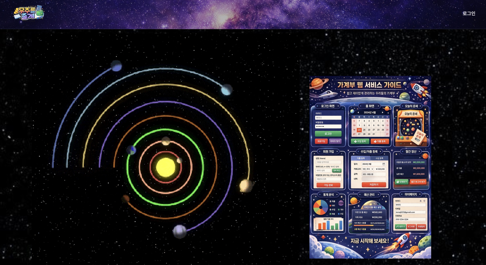
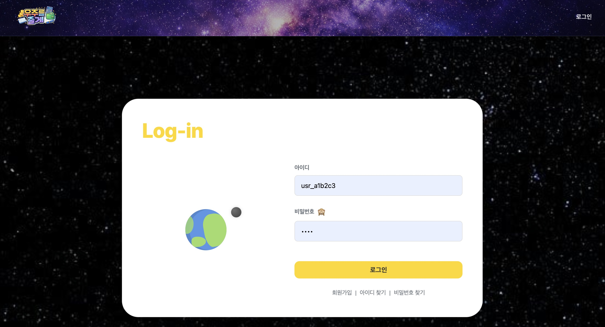
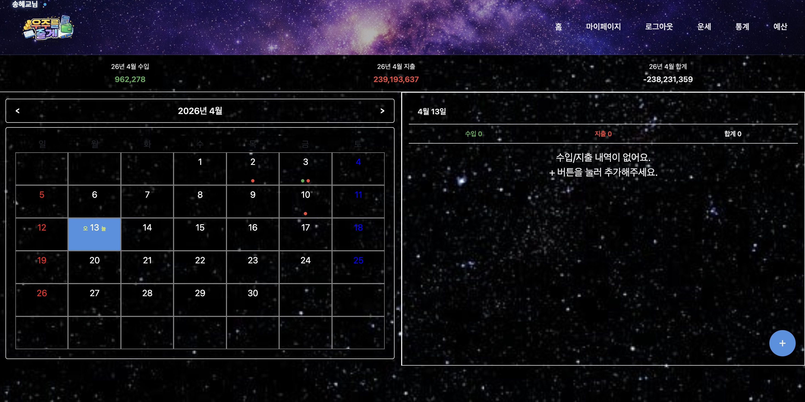
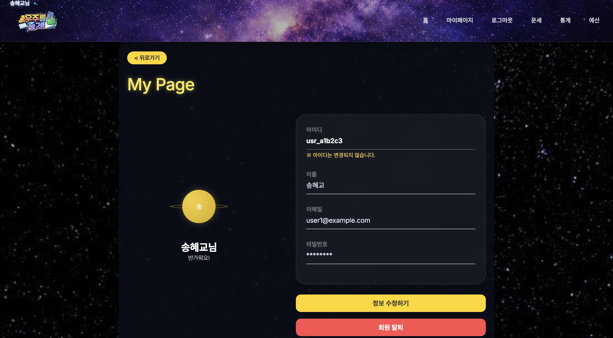
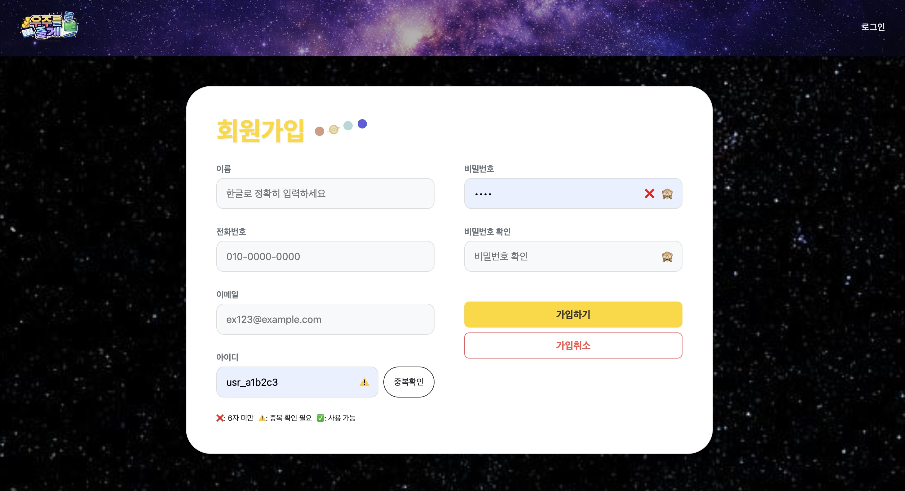
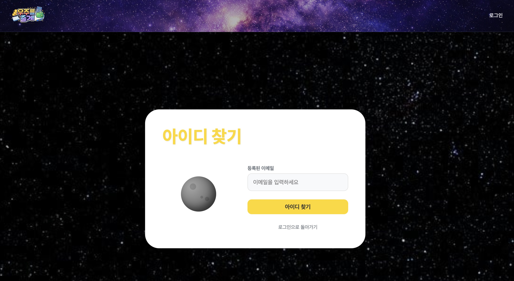
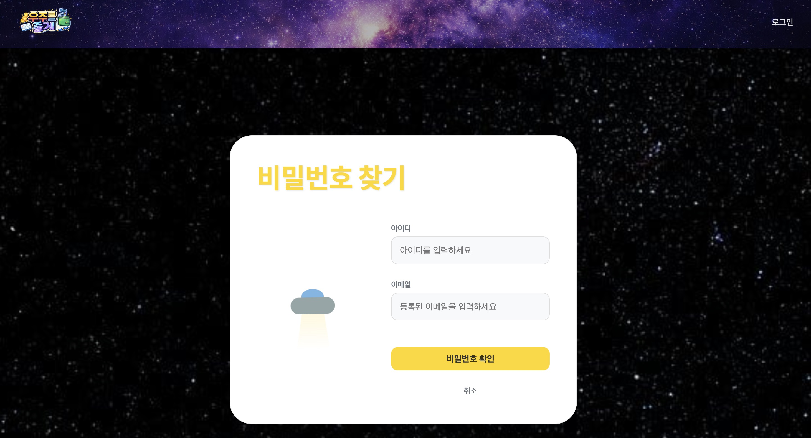
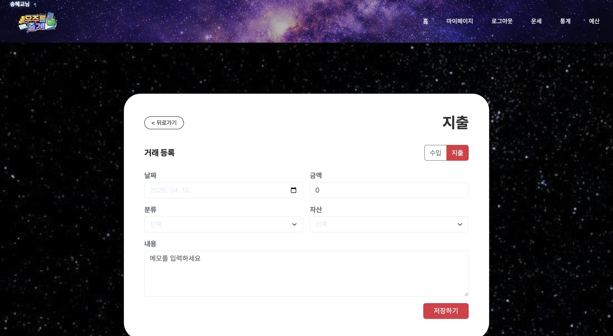
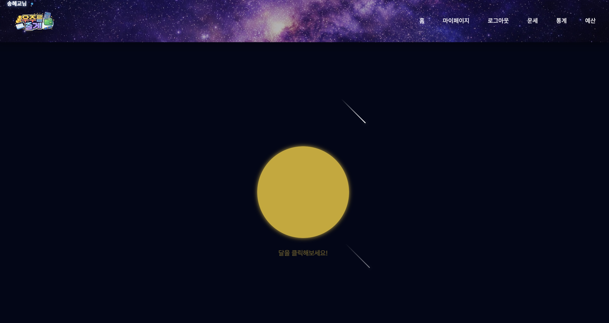
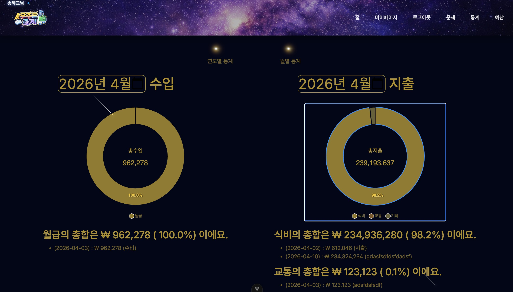

# 🚀 Money Log - 우주 컨셉 가계부 웹

Vue 3 + Pinia + json-server 기반의 가계부 웹 애플리케이션이다.
우주 컨셉 UI를 적용하여 시각적인 재미와 데이터 분석 기능을 동시에 제공한다.

---

## 📌 기술 스택

* Vue 3 (Composition API)
* Vite
* Pinia (상태관리)
* Vue Router
* Axios
* Bootstrap 5
* ApexCharts
* json-server (Mock API)

---

## 📂 프로젝트 구조

```
src/
├── assets/        # 이미지, CSS, GIF
├── components/    # 공통 UI 컴포넌트
├── pages/         # 라우터 연결 페이지
├── stores/        # Pinia 상태 관리
├── router/        # 라우팅 설정
├── statics/       # 통계 기능
├── totalBudget/   # 예산 기능
├── fortune/       # 운세 기능
├── settle/        # 정산 기능
├── App.vue
└── main.js
```

---

## 🧩 주요 기능

### 🔐 사용자 기능

* 회원가입 / 로그인
* 아이디 / 비밀번호 찾기
* 마이페이지

### 💰 가계부 기능

* 수입 / 지출 등록
* 거래 내역 조회
* 수정 / 삭제

### 📊 통계 기능

* 월별 수입 / 지출 분석
* 연간 통계
* 차트 시각화

### 🌙 예산 관리

* 월별 예산 설정
* 소비 비율 시각화 (달 UI)

### 🔮 부가 기능

* 운세 조회
* 지출 정산

---
## 화면 이미지













---

## 🔄 데이터 흐름

```
UI → Component → Store → Axios → json-server
```

---

## 🗂 상태 관리

| Store            | 설명           |
| ---------------- | ------------ |
| userStore        | 로그인 및 사용자 관리 |
| transactionStore | 거래 데이터 관리    |
| staticsStore     | 통계 및 예산 계산   |

---

## ⚙️ 실행 방법

```
# 패키지 설치
npm install

# 프론트 실행
npm run dev

# json-server 실행
npm run server
```

---

## 📁 Mock 데이터

* db.json : 사용자 / 거래 / 예산 데이터
* fortune.json : 운세 데이터

---

## 🧠 개선 포인트

* pages / components 구조 분리 필요
* API 호출 로직을 services로 분리
* store 역할 세분화
* 네이밍 규칙 통일

---

## 🌌 컨셉

우주 컨셉 UI를 적용하여
"소비 흐름을 하나의 우주처럼 시각화" 하는 것을 목표로 한다.
